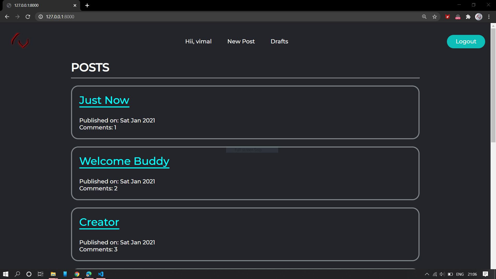
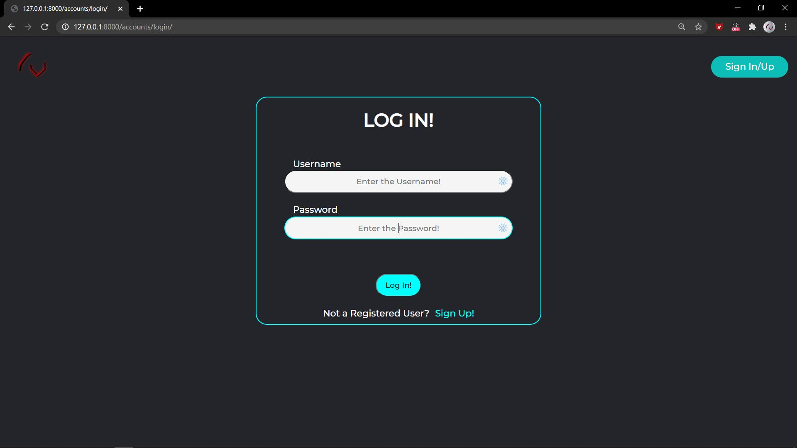
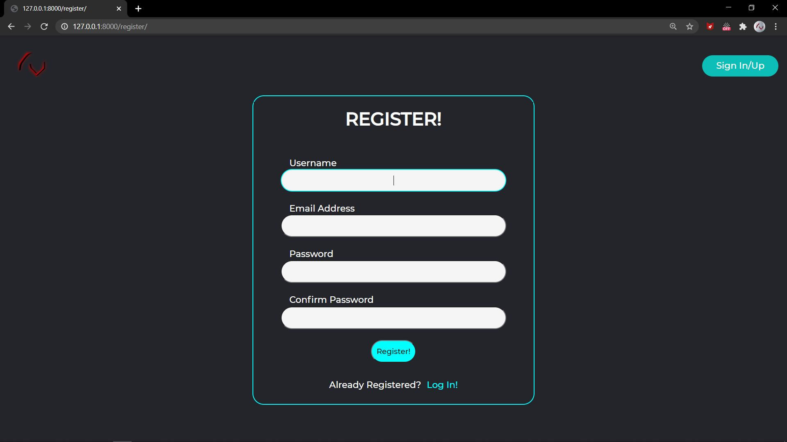
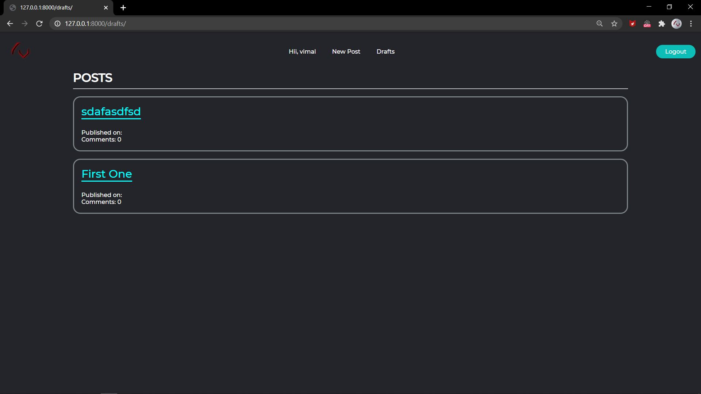
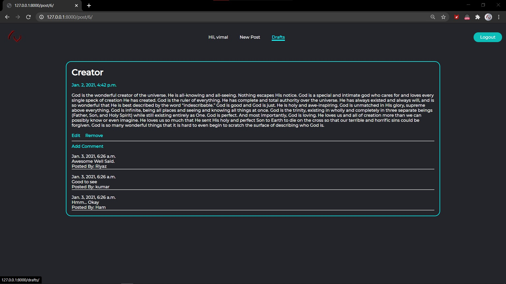
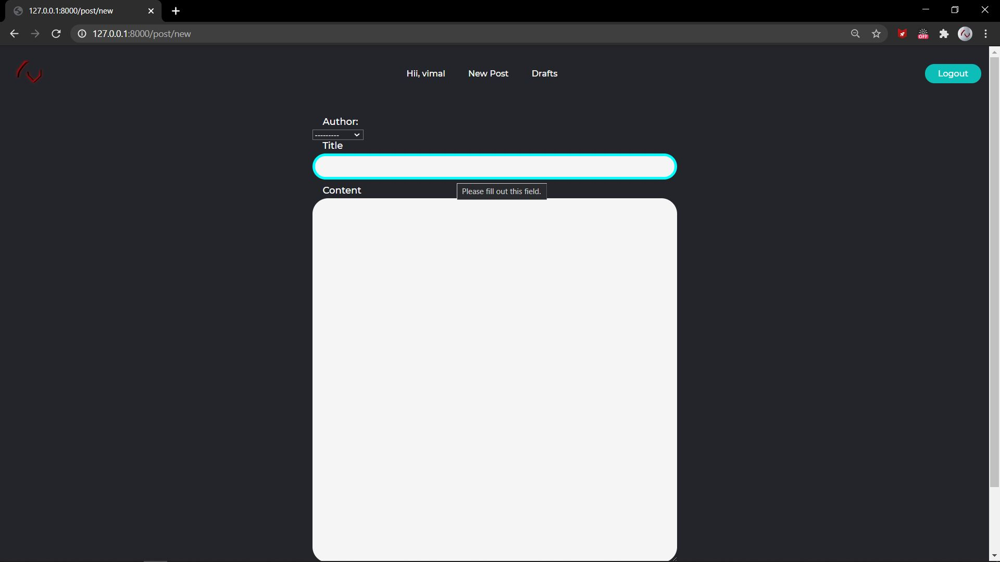
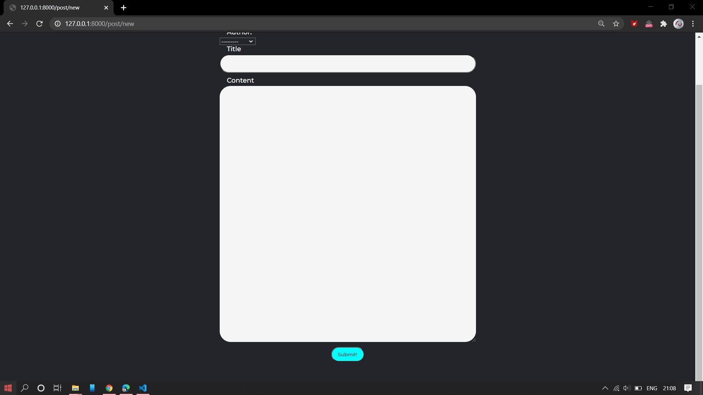

# Aesthtetic-Blog-App

<ul>

 Following features are implemented in this Aesthetic and Minimalistic Blog App 

<li>CRUD</li>
<li>Decorators</li>
<li>Role-based Access (Has source code file but not implemented)</li>
<li>Class Based Views</li>
</ul>
 
 
 
<h2>Previews Of this Cool Blog App</h1>
<h4>Home Page</h4>

<h4>Login Page!</h4>

<h4>Sign Up!</h4>

<h4>Drafts</h4>

<h4>Post Details</h4>

<h4>Adding Posts</h4>

